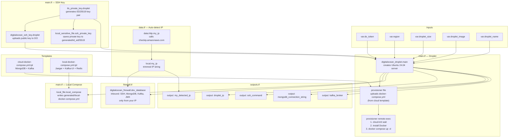
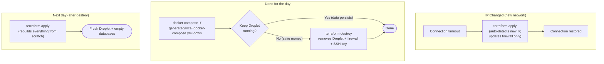

# Workflow Diagrams

## Terraform Resource Dependency Graph

How Terraform resources depend on each other. Terraform builds resources in parallel where possible, respecting these dependencies.

---

## Setup Workflow (Step by Step)

What happens from start to finish when you set up and use this project.

```mermaid
flowchart TD
    START([Start]) --> INSTALL[Install Terraform >= 1.5]
    INSTALL --> CREATE_TOKEN[Create DigitalOcean API token<br/>with 19 custom scopes]
    CREATE_TOKEN --> CLONE[Clone this repo]
    CLONE --> TFVARS["Create terraform.tfvars<br/>do_token = your_token"]
    TFVARS --> INIT["terraform init<br/>downloads providers:<br/>digitalocean, local, tls, http"]
    INIT --> PLAN["terraform plan<br/>preview: 1 SSH key, 1 Droplet,<br/>1 firewall, 2 local files"]
    PLAN --> REVIEW{Review plan<br/>looks good?}
    REVIEW -- No --> EDIT[Edit variables.tf<br/>or terraform.tfvars]
    EDIT --> PLAN
    REVIEW -- Yes --> APPLY["terraform apply<br/>type 'yes'"]

    APPLY --> PHASE1

    subgraph PHASE1 ["Phase 1 — Parallel (no dependencies)"]
        direction LR
        P1A["Detect your public IP<br/>(data.http.my_ip)"]
        P1B["Generate SSH key pair<br/>(tls_private_key)"]
    end

    PHASE1 --> PHASE2

    subgraph PHASE2 ["Phase 2 — Depends on SSH key"]
        direction LR
        P2A["Upload public key to DO<br/>(digitalocean_ssh_key)"]
        P2B["Save private key locally<br/>(generated/id_ed25519)"]
    end

    PHASE2 --> PHASE3

    subgraph PHASE3 ["Phase 3 — Create Droplet"]
        P3A["Provision Droplet<br/>Ubuntu 24.04, sgp1, 4GB RAM"]
    end

    PHASE3 --> PHASE4

    subgraph PHASE4 ["Phase 4 — Provisioners (on Droplet, sequential)"]
        direction TB
        P4A["Upload docker-compose.yml<br/>(template with real IP injected)"]
        P4B["cloud-init status --wait"]
        P4C["Install Docker Engine"]
        P4D["Enable Docker on boot"]
        P4E["docker compose up -d<br/>(MongoDB + Kafka start)"]
        P4A --> P4B --> P4C --> P4D --> P4E
    end

    PHASE4 --> PHASE5

    subgraph PHASE5 ["Phase 5 — Parallel (depends on Droplet IP)"]
        direction LR
        P5A["Create firewall<br/>(your IP only on ports<br/>22, 9092, 9101, 27017)"]
        P5B["Generate local-docker-compose.yml<br/>(Droplet IP injected)"]
    end

    PHASE5 --> OUTPUT["Terraform prints outputs:<br/>droplet_ip, ssh_command,<br/>mongodb_connection_string,<br/>kafka_broker, my_detected_ip"]

    OUTPUT --> LOCAL_UP["docker compose -f<br/>generated/local-docker-compose.yml up -d<br/>(starts Jaeger, Kafka-UI, Redis)"]
    LOCAL_UP --> ENV["Update your app .env:<br/>MongoDB → droplet_ip:27017<br/>Kafka → droplet_ip:9092<br/>Redis → localhost:6379<br/>Jaeger → localhost:4317"]
    ENV --> DEV([Ready to develop])

    style PHASE1 fill:#e8f4f8,stroke:#0969da
    style PHASE2 fill:#e8f4f8,stroke:#0969da
    style PHASE3 fill:#dafbe1,stroke:#1a7f37
    style PHASE4 fill:#fff8c5,stroke:#9a6700
    style PHASE5 fill:#e8f4f8,stroke:#0969da
```

---

## Day-to-Day Operations

